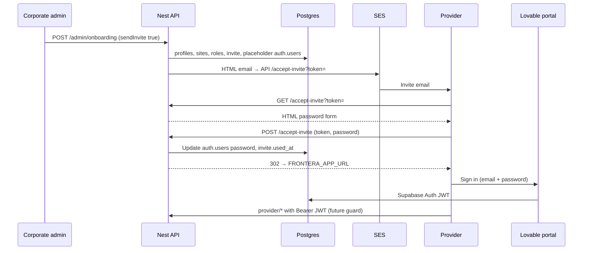

# Provider onboarding & invite (password setup)

How corporate onboarding connects to the provider’s first sign-in. Aligns with **Scheduling_Workflow-1.pdf** Phase 1 (`CorporateOnboardProvider.tsx`) and Q2 in the delivery plan.

Related: [scheduling-workflow.md](./scheduling-workflow.md) · [ADR-0004](./adr/0004-onboard-new-provider.md) · [ADR-0002](./adr/0002-scheduling-workflow-backend-shape.md) · Supabase Auth (passwords/JWTs).

**Implementation:** Nest serves the accept-invite HTML form and activates the account (`src/onboarding/invites/invites.controller.ts`).

---

## Short answer: email vs form

The invite is sent as an **HTML email** (SES). The **password form is a Nest HTML page**, not inside the email.

| Part | Where it lives |
|------|----------------|
| Branded message, **“Set up your account”** link | **HTML email** (Nest → `SesGateway`) |
| Email + password + confirm | **Nest** `GET/POST /accept-invite` (HTML form) |
| Password hash | **`auth.users.encrypted_password`** (Postgres, bcrypt via `pgcrypto`) |
| Ongoing API access | **Supabase JWT** on `provider/*` (Q1 guard, planned) |

Standard pattern: **link in email → API-hosted page over HTTPS → server sets password on pre-created `auth.users` row → provider signs in with Supabase Auth**.

---

## Who renders the password page?

| Layer | Role |
|-------|------|
| **Nest API (Lambda)** | **Yes** — `GET /accept-invite` (form), `POST /accept-invite` (activate) |
| **Lovable (provider portal)** | **No** for accept-invite — login/dashboard only after activation |
| **Supabase Auth** | Sign-in / JWT after password exists in `auth.users` |

```text
Admin → POST /admin/onboarding (+ optional invite)
     → DB: profiles, provider_work_sites, user_roles, provider_invites, placeholder auth.users
     → SES: link to FRONTERA_API_PUBLIC_URL/accept-invite?token=...

Provider → GET /accept-invite?token=...  (HTML form from Nest)
        → POST /accept-invite (password to Nest over TLS)
        → DB: bcrypt password on auth.users, provider_invites.used_at
        → Redirect to FRONTERA_APP_URL (provider portal)

Provider → Lovable sign-in → Supabase Auth → Bearer JWT on provider/* APIs
```

---

## Is this approach correct?

**Yes for v1 / your current stack**, with clear tradeoffs. It is a valid production pattern when you already pre-create `auth.users` at onboard and want one branded email + one deployment (Lambda).

### What works well

| Benefit | Why |
|---------|-----|
| **Single invite email** | Nest SES + your HTML — no duplicate Supabase invite mail |
| **Aligned IDs** | `profiles.user_id` and `auth.users.id` created together at onboard; accept only sets password |
| **Simple Lovable scope** | Corporate onboard + provider login; no `/accept-invite` SPA to maintain |
| **Invite security** | Random token, `expires_at`, single-use `used_at`, HTTPS link |
| **Same DB as seed** | Bcrypt via `crypt(..., gen_salt('bf'))` — same technique as local seed scripts |

### Tradeoffs (know these)

| Topic | Current choice | Note |
|-------|----------------|------|
| **Password transits Nest** | Form POST to Lambda | Acceptable over **HTTPS**; do not log request bodies; consider rate limits / CAPTCHA later |
| **Not Supabase client signUp** | Server updates `auth.users` | Password never goes to Supabase Auth HTTP API from the browser; login still uses Supabase `signInWithPassword` if hash format matches |
| **DB permissions** | Direct SQL on `auth.users` | Requires DB role that can read `auth.instances` and write `auth.users` (prefer **direct** Supabase connection, not transaction pooler-only) |
| **Auth features** | Supabase dashboard policies | Password strength / MFA / breach detection rely on Supabase settings at **sign-in** time |
| **HTML on API** | Mixed JSON + HTML on same Lambda | Fine at your scale; exclude `/accept-invite` from Swagger (`@ApiExcludeController`) |

### When to reconsider

Move password setup to **Supabase from the browser** (still on a Nest-hosted page with embedded JS, or Lovable `/accept-invite`) if you need:

- Supabase-only credential handling (password never hits Nest logs/memory)
- Built-in email confirmation flows from Auth
- `signUp` without pre-created `auth.users` rows

Use **Supabase Admin API** (`service_role`) from Nest instead of raw SQL if direct `auth.users` writes break in hosted Supabase or login fails after accept.

### Verdict

| Stage | Recommendation |
|-------|----------------|
| **Now (sandbox, Lovable admin + portal)** | **Keep this approach** — set `FRONTERA_API_PUBLIC_URL`, test accept + `signInWithPassword` |
| **Before production scale** | Add rate limiting on `POST /accept-invite`, confirm login works in Supabase, SES production access |
| **Later hardening** | Optional CAPTCHA; optional migrate POST password to Supabase client while keeping Nest HTML shell |

---

## Security

### Invite link (`token`)

| Control | Implementation |
|---------|----------------|
| Random token | `provider_invites.token` (64-char hex-style string) |
| Expiry | `provider_invites.expires_at` (7 days on create/resend) |
| Single use | `used_at` + `created_user_id` on successful POST |
| HTTPS | API Gateway + TLS in production |

### Password handling

| Do | Don't |
|----|--------|
| Serve form only over HTTPS | Log `POST /accept-invite` bodies |
| Min length 8 (API) | Store plaintext password in `profiles` |
| Mark invite used in same flow as password update | Reuse tokens after `used_at` |

Nest receives the password **once** on POST to activate the account. This is similar to a **password-reset** server form, not the same as “password only in Supabase JS client.” Mitigate with TLS, no body logging, and future rate limits.

### After activation

Provider signs in on **Lovable** with email + password via **Supabase Auth**. Nest `provider/*` routes should use **JWT** (`jwt.sub` = `profiles.user_id`) when the guard ships.

---

## End-to-end flow



---

## Phase 1 — Corporate onboard (admin)

**FE:** `CorporateOnboardProvider.tsx`  
**API:** `POST /admin/onboarding` (**built**)

Creates:

- `profiles` — identity, recruiter/liaison, `schedule_type`, etc.
- `provider_work_sites` — facilities + `weekly_schedule` (set-schedule)
- `user_roles` — `provider_user`
- `assignments`, `provider_invites`
- **`auth.users`** — placeholder row (`email_confirmed_at` null until accept)

`sendInvite` default **true** sends SES email after successful create.

---

## Phase 2 — Send / resend invite email

**API:** `POST /admin/onboarding/:userId/invite` (**built**)  
**Infra:** `SES_FROM_EMAIL`, `SesGateway`, `FRONTERA_API_PUBLIC_URL`

### Email link format

```text
{FRONTERA_API_PUBLIC_URL}/accept-invite?token={provider_invites.token}
```

Example:

```text
https://abc123.execute-api.us-east-1.amazonaws.com/accept-invite?token=...
```

Fallback if `FRONTERA_API_PUBLIC_URL` is unset: `FRONTERA_APP_URL` (only use if the app host is the same origin as the API).

### Sandbox SES

Verify **From** (`noreply@fronteraportal.com`) and **To** (each recipient Gmail) in SES, or use a verified domain for `@fronteraportal.com` addresses.

---

## Phase 3 — Accept invite (Nest HTML)

**API:** `GET /accept-invite`, `POST /accept-invite` (**built**)  
**Code:** `InvitesController`, `InvitesService`, templates under `src/onboarding/invites/templates/`

1. Provider opens link with `?token=`.
2. **GET** validates token (exists, not expired, not used) and returns HTML form (email read-only).
3. **POST** `application/x-www-form-urlencoded`: `token`, `password`, `confirmPassword`.
4. Server sets `auth.users.encrypted_password`, `email_confirmed_at`, `provider_invites.used_at`.
5. **302 redirect** to `FRONTERA_APP_URL?activated=1` (or simple HTML success if portal URL is relative).

Errors re-render the form with a message, or show a static error page for invalid/expired tokens.

---

## Phase 4 — Ongoing sign-in

Provider uses **Lovable provider portal**:

- Email from invite / profile
- Password set on accept-invite
- `supabase.auth.signInWithPassword` (FE)

**API:** Planned Q1 JWT guard on `provider/*` — `Authorization: Bearer <access_token>`.

---

## Data model

| Table / system | Role |
|----------------|------|
| `provider_invites` | `token`, `email`, `expires_at`, `used_at`, `created_user_id`, snapshot fields |
| `profiles.user_id` | Set at onboard; same id as `auth.users.id` |
| `user_roles` | `provider_user` at onboard |
| `auth.users` | Placeholder at onboard; password + `email_confirmed_at` at accept |

---

## API surface

| Method | Route | Status |
|--------|-------|--------|
| POST | `/admin/onboarding` | **Built** |
| POST | `/admin/onboarding/:userId/invite` | **Built** |
| GET | `/accept-invite?token=` | **Built** (HTML) |
| POST | `/accept-invite` | **Built** (HTML form POST) |
| GET | `/admin/onboarding/form-options` | **Built** |
| GET | `/admin/onboarding/work-sites` | **Built** |

Swagger documents JSON admin routes only; accept-invite is HTML (`@ApiExcludeController`).

---

## Environment

| Variable | Purpose |
|----------|---------|
| `SES_FROM_EMAIL` | From address (e.g. `noreply@fronteraportal.com`) |
| `FRONTERA_API_PUBLIC_URL` | **Invite link host** — API Gateway URL, no trailing slash |
| `FRONTERA_APP_URL` | Provider portal — redirect after successful activation |
| `DATABASE_URL` | Direct or session pooler; must allow `auth.users` writes |
| `FRONTERA_AWS_REGION` | Same region as SES identities |
| `SUPABASE_URL` | Project URL (JWT / future FE Auth) — not the Postgres URL |

Deployed via [serverless.yml](../serverless.yml) (`useDotenv: true` on deploy).

---

## Testing checklist

- [ ] `FRONTERA_API_PUBLIC_URL` set to deployed API base URL; redeploy Lambda
- [ ] SES sandbox: verified To/From
- [ ] `POST /admin/onboarding` with `email` = verified recipient; `inviteSent: true`
- [ ] Open email link → form loads
- [ ] POST password → redirect; `provider_invites.used_at` set
- [ ] Lovable sign-in with same email + password (Supabase Auth)
- [ ] Resend: `POST /admin/onboarding/:userId/invite`

**Without email:** use `inviteToken` from create response (dev only):

```text
{FRONTERA_API_PUBLIC_URL}/accept-invite?token={inviteToken}
```

---

## Lovable responsibilities (updated)

| Screen | Responsibility |
|--------|----------------|
| Corporate Onboard New Provider | `POST /admin/onboarding` — do **not** duplicate `defaultWeeklySchedule` and per-site `weeklySchedule` (API rejects overlap) |
| Accept invite | **Not Lovable** — Nest HTML at API URL |
| Provider portal | Login + app screens; Supabase session → future Bearer on `provider/*` |

---

## Implementation checklist

- [x] `OnboardingService.create` — DB rows + optional SES
- [x] `OnboardingService.sendInvite` — resend email
- [x] `FRONTERA_API_PUBLIC_URL` / `FRONTERA_APP_URL` in config + serverless
- [x] Nest `/accept-invite` GET + POST + templates
- [x] `activateProviderInvite` repository method
- [ ] Q1 JWT guard on `provider/*`
- [ ] Rate limit / CAPTCHA on accept (optional)
- [ ] Confirm Supabase `signInWithPassword` after SQL bcrypt update (smoke test in prod-like env)
