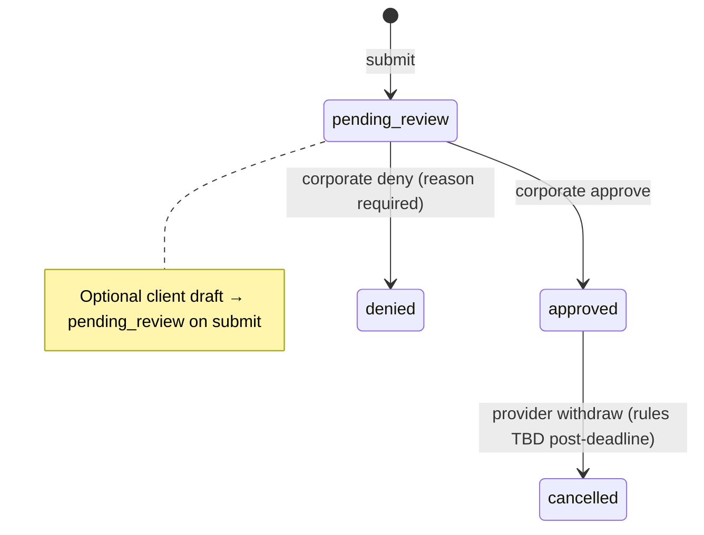

# Scheduling workflow (FE → backend map)

Source: `~/Downloads/Scheduling_Workflow-1.pdf` (Scheduling Feature — End-to-End Workflow).  
This doc maps that workflow to **Frontera’s schema**, **Nest API** (this repo), and **implementation status**.  
Architectural choices: [ADR-0002](./adr/0002-scheduling-workflow-backend-shape.md). Optum-only tenancy: [ADR-0001](./adr/0001-optum-single-client-defer-multi-tenant.md).

---

## Actors & portals

| Actor | Portal | `app_role` | Primary goal |
|--------|--------|------------|----------------|
| Provider (set-schedule W2/1099) | Provider | `provider_user` | Time off / schedule changes vs weekly pattern |
| Provider (PRN) | Provider | `provider_user` | Monthly availability; view finalized schedule |
| Recruiter / internal staff | Corporate | `internal_staff` | Review, approve, deny, publish schedules |
| Admin | Corporate (+ switch) | `admin` | Same as staff + cross-portal visibility |
| Client (dormant) | Client | `client_user` | View finalized coverage at facility |

---

## Core business rules (backend must enforce)

| Rule | Detail | Enforce in |
|------|--------|------------|
| **Deadline** | Changes for target month M due by **last Tuesday of month M−2** (e.g. April last Tue → June). | Nest service + shared date helper (Q1) |
| **Pre-deadline** | Free edits; **no PACR**. | Validation on submit |
| **Post-deadline** | Add/remove shifts require **PACR PDF**; add ≥14 days notice, remove ≥7 days. | Validation + `pacr_document_id` required |
| **Schedule types** | `set` = recurring weekly pattern; `PRN` = monthly availability grid. | `profiles.schedule_type` |
| **Warning badges** | Corporate alert if span **>14 calendar days** OR **>50%** of provider’s standard weekly hours for span. | Review-queue read model (Q3) |
| **Recruiters** | Fixed list of 5; every provider has exactly one recruiter. | `profiles.recruiter_id` / denormalized contact fields |
| **Multi-site** | Requests and calendar cells keyed to **`work_site_id`**. | `time_off_requests.work_site_id`, `provider_work_sites` |
| **ACE/IMO export** | Excel workbook, **one sheet per recruiter**. | Q4 export job |

---

## Phases → FE pages → data → API

### Phase 1 — Onboard provider (Corporate)

| | |
|--|--|
| **FE** | `CorporateOnboardProvider.tsx` |
| **Goal** | Profile + sites + weekly pattern + recruiter + liaison |
| **Writes** | `profiles`, `provider_work_sites`, `user_roles`, `provider_invites` (invite flow) |
| **Side effects** | HTML invite email (SES) → Nest `/accept-invite` password page → Supabase sign-in on Lovable portal |

| API (planned) | Status |
|---------------|--------|
| `POST /admin/onboarding` | Stub (`OnboardingModule`) |
| `POST /admin/onboarding/:userId/invite` | Stub (SES HTML email + link, not form in email) |
| Accept-invite + password | Nest HTML `GET/POST /accept-invite` — see [onboarding-invite-flow.md](./onboarding-invite-flow.md) |

---

### Phase 2 — Provider submits availability / change

| | |
|--|--|
| **FE** | `ProviderAvailability.tsx` (PRN), `ProviderSchedule.tsx`, `PacrEditorDialog.tsx` |
| **PRN** | Month grid → per-day editor → batch **`time_off_requests`** `pending_review` |
| **Set-schedule** | Deviations from `work_schedule` + `provider_work_sites.weekly_schedule`; pre/post deadline PACR UX |
| **PACR** | In-browser PDF → S3 `pacr/{provider_id}/{request_id}.pdf` → `documents` + `time_off_requests.pacr_document_id` |

| API (planned) | Status |
|---------------|--------|
| `GET /provider/:providerId/scheduling/context` | **Built** ([0009](./adr/0009-provider-availability-calendar.md)) |
| `GET /provider/:providerId/scheduling/availability` | **Built** |
| `POST /provider/:providerId/scheduling/availability/submit` (PRN batch) | **Built** |
| `POST /provider/:providerId/documents/upload` (PACR) | **Built** |
| `POST /provider/scheduling/time-off` | Stub |
| `GET /admin/documents/:id/download` (signed URL) | Stub |

**PDF edge fn names → Nest:** `submit-availability` → submit endpoints above.

---

### Phase 3 — Corporate review & approval

| | |
|--|--|
| **FE** | `CorporateTimeOffReview.tsx`, `CorporatePTOCalendar.tsx`, `CorporateAvailabilityCalendar.tsx`, `CorporatePRNAvailability.tsx`, **Master Availability Calendar** |
| **Queue** | `pending_review`, filters: recruiter, facility, region, employment_type, schedule_type, dates |
| **Row UI** | Provider, dates, hours impact, PACR download, warning badges |
| **Approve** | Confirm if thresholds → `approved`, `reviewed_by`, `reviewed_at` |
| **Deny** | `denied` + required `review_notes` |
| **PACR email** | On approve when PACR present + late → liaison (SES) |

| API (planned) | Status |
|---------------|--------|
| `GET /admin/scheduling/review-queue` | **Built** (recruiterId, workSiteId, page; no warnings/PACR yet) |
| `POST /admin/scheduling/requests/:id/approve` | Stub |
| `POST /admin/scheduling/requests/:id/deny` | Stub |
| `GET /admin/scheduling/calendars/*` | Stub |
| `POST /admin/scheduling/exports/ace-imo` | Stub |

**PDF edge fn names → Nest:** `approve-request`, `deny-request`, `notify-liaison-pacr` (triggered from approve when rules match).

---

### Phase 4 — Month finalization & publish

| | |
|--|--|
| **FE** | `useScheduleFinalized`; PRN “My Schedule” gated until finalized |
| **Writes** | `schedule_finalizations` per **work_site + month_year** |
| **Set-schedule** | Rolling 12-month projection regardless of finalization |

| API (planned) | Status |
|---------------|--------|
| `POST /admin/scheduling/finalize-month` | Stub |
| `GET /admin/scheduling/finalized` | Stub |
| `GET /provider/scheduling/finalized` | Stub (provider-facing gate) |

---

### Phase 5 — Downstream consumers

| Consumer | FE | Data source |
|----------|-----|-------------|
| Provider schedule view | `ProviderSchedule.tsx` | Approved `time_off_requests` + weekly pattern |
| Timesheet | `ProviderTimesheet.tsx` | Approved shifts; W2 biweekly / 1099 weekly |
| Client (dormant) | `ClientSchedules.tsx` | Finalized coverage by facility |
| Notifications | `useNotifications` | `notifications` + email queue |

Read APIs mostly **GET** aggregates; can be Nest or Supabase read with RLS (decide per screen in ADR-0002).

---

## Schema mapping (PDF → Drizzle)

| PDF / suggested | This repo (`schema.ts`) | Notes |
|-----------------|-------------------------|--------|
| `facilities` | `work_sites` | `client_name` default Optum |
| `provider_work_sites.weekly_schedule` | `jsonb` | PDF open Q: structured JSON vs `profiles.work_schedule` text |
| `time_off_requests` | ✓ | Per-day rows; `change_type`, `status`, `pacr_document_id` |
| `schedule_finalizations` | ✓ | `work_site_id`, `month_year`, `status` |
| `secure_documents` | `documents` + S3 bucket | Category `pacr` |
| `notifications` | ✓ | |
| `audit_log` | ✓ + `log_audit()` | Use on approve/deny/finalize |
| Holidays / closures | `holidays` only | PDF: need facility-scoped closure table (open) |

---

## Request state machine

| Transition | Side effects |
|------------|----------------|
| → `pending_review` | Validate deadline/PACR/notice days |
| → `approved` | Audit; if PACR + late → liaison email (SES) |
| → `denied` | Audit; notify provider |
| Month publish | `schedule_finalizations.finalized` |

---

## API backlog (consolidated)

| Priority | Method | Route | Phase |
|----------|--------|-------|-------|
| Q1 | — | JWT guard, deadline helper | Foundation |
| Q2 | POST | `/admin/onboarding` | 1 |
| Q2 | POST | `/provider/scheduling/availability/submit` | 2 |
| Q2 | POST | `/provider/scheduling/time-off` | 2 |
| Q2 | POST | `/provider/documents/upload` | 2 |
| Q3 | GET | `/admin/scheduling/review-queue` | 3 ✅ |
| Q3 | POST | `/admin/scheduling/requests/:id/approve` | 3 |
| Q3 | POST | `/admin/scheduling/requests/:id/deny` | 3 |
| Q3 | GET | `/admin/scheduling/calendars/...` | 3 |
| Q3 | GET | `/admin/master-availability/*` | 3 — [ADR-0005](./adr/0005-master-availability-calendar.md) |
| Q4 | POST | `/admin/scheduling/finalize-month` | 4 |
| Q4 | POST | `/admin/scheduling/exports/ace-imo` | 3–4 |
| Q5 | GET | `/provider/scheduling/schedule` | 5 |

---

## Open questions (from PDF — track here until ADR/CONTEXT)

1. **One row per day vs contiguous range** for `time_off_requests` — current: per day.  
2. **Canonical weekly schedule** — `provider_work_sites.weekly_schedule` JSON vs `profiles.work_schedule` text.  
3. **Facility closure overrides** — table per `work_site` + date (not only `holidays`).  
4. **PACR versioning** on resubmit.  
5. **Realtime** — Supabase Realtime on `time_off_requests` for corporate calendars vs polling Nest.

---

## Related code today

- `src/onboarding/` — `admin/onboarding` (separate from scheduling)
- [onboarding-invite-flow.md](./onboarding-invite-flow.md) — invite email (HTML + link) vs password form on `/accept-invite`  
- `src/scheduling/admin/` — corporate scheduling routes  
- `src/scheduling/provider/` — provider scheduling routes  
- `src/documents/` — `admin/documents` + `provider/documents` stubs  
- `src/repository/persistence/repository.ts` — `listPendingTimeOffForReview`  
- `npm run db:seed` — 3 `pending_review` + 1 `approved` sample rows  
