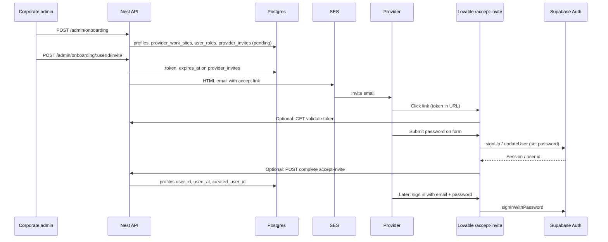

# Provider onboarding & invite (password setup)

How corporate onboarding connects to the provider’s first sign-in. Aligns with **Scheduling_Workflow-1.pdf** Phase 1 (`CorporateOnboardProvider.tsx`) and Q2 in the delivery plan.

Related: [scheduling-workflow.md](./scheduling-workflow.md) · [ADR-0002](./adr/0002-scheduling-workflow-backend-shape.md) · Supabase Auth (passwords/JWTs).

---

## Short answer: email vs form

The invite is sent as an **HTML email** (SES), but the **password form is not inside the email**.

| Part | Where it lives |
|------|----------------|
| Branded message, instructions, **“Set up your account” button** | **HTML email** (Nest → `SesGateway`) |
| Email + password (+ confirm) fields | **Provider portal web page** — Lovable route `/accept-invite?token=...` |
| Stored password | **Supabase Auth** (`auth.users`) — never in `profiles` or Nest |

Email clients cannot run secure account-creation forms reliably. Standard pattern: **link in HTML email → open app in browser → form on your site → Supabase creates the user**.

---

## Who renders the password page?

**Not the Nest backend** in this project’s architecture.

| Layer | Renders HTML pages? | Role |
|-------|---------------------|------|
| **Lovable (provider portal)** | **Yes** | `/accept-invite` UI, form, client-side validation |
| **Nest API (Lambda)** | **No** (JSON API only) | Onboarding, invite email, optional “finalize invite” after Auth |
| **Supabase Auth** | No (Auth API) | Creates user, hashes password, issues JWT |

The delivery plan keeps the **UI on Lovable** and the **API on Nest** ([ADR-0002](./adr/0002-scheduling-workflow-backend-shape.md)). Nest returns JSON over HTTPS; it does not serve the password-setup HTML unless you explicitly add that later (out of current scope).

```text
Browser → Lovable static/SPA (password form)
       → Supabase Auth HTTPS API (password never to Nest)
       → Nest HTTPS API (optional: mark invite used, with JWT or server-validated token)
```

---

## Security: password and backend calls

### Golden rule: password goes to Supabase, not Nest

The provider’s password should be sent **only** from the browser to **Supabase Auth** (`signUp` / `updateUser`), over **HTTPS**. Nest should **not** receive, log, or store the plaintext password.

| Data | Send to |
|------|---------|
| Password | **Supabase Auth** only |
| Invite `token` (from URL) | Nest (validate / complete) — token is not a password |
| After login | Nest receives **`Authorization: Bearer <access_token>`** (JWT), not the password |

That split is how you keep credential handling standard and auditable: Supabase is built for password hashing, rate limits, and breach-resistant storage; your API never touches secrets.

### Securing the invite link (`token`)

| Control | Purpose |
|---------|---------|
| **Cryptographically random token** | Stored in `provider_invites.token`; not guessable |
| **`expires_at`** | Reject expired invites server-side |
| **Single use** | Set `used_at` when accepted; reject reuse |
| **HTTPS only** | App and API only on TLS (Lovable + API Gateway) |
| **HTTPS link in email** | No `http://` accept links in production |

The token in the URL is a **one-time capability**, like a reset link — not a long-lived password. Treat leaked URLs like leaked reset links: short TTL + one-time redemption.

### Securing “complete invite” Nest calls (after password is set)

Two safe patterns (pick one with FE):

**Pattern A — Recommended: Supabase first, then Nest with JWT**

1. FE: user submits password → `supabase.auth.signUp()` (or equivalent).
2. Supabase returns **session + access token** (user now exists).
3. FE: `POST /provider/onboarding/invites/accept` with header `Authorization: Bearer <jwt>` and body `{ token }` (invite token from URL).
4. Nest: verify JWT (Q1 guard), confirm `jwt.sub` matches invite email/profile, mark `provider_invites.used_at`, set `profiles.user_id`.

Nest never saw the password; it only trusts **Supabase-issued JWT** + invite row checks.

**Pattern B — Validate token, then Supabase, then Nest finalize**

1. FE: `GET /provider/onboarding/invites/validate?token=` → Nest returns `{ email, valid }` (no password).
2. FE: password → Supabase Auth only.
3. FE: `POST .../accept` with JWT + `token` as in Pattern A.

Do **not** use Pattern “POST password + token to Nest” — that expands PCI/PII scope and logging risk for no benefit.

### Transport and headers

- All calls: **TLS 1.2+** (browser ↔ Lovable, browser ↔ Supabase, browser ↔ API Gateway).
- Nest: **CORS** restricted to Lovable origin(s) in production.
- Nest: global **ValidationPipe** on JSON bodies; no password field on DTOs.
- **No password in logs** — avoid logging request bodies on accept routes; redact in error middleware.

### What Nest can enforce on accept (business security)

- Token exists, not expired, `used_at` is null.
- Invite `email` matches authenticated user’s email (or `profiles` row).
- Assign / confirm `provider_user` role.
- `audit_log` entry for `invite` / `login` actions.

### What Supabase enforces (auth security)

- Password strength policy (dashboard settings).
- Rate limiting / bot protection (Supabase + optional CAPTCHA on FE).
- Bcrypt (or configured) hashing in `auth.users`.
- Optional email confirmation before full access.
- JWT expiry and refresh for later `provider/*` API calls.

### Optional hardening (later)

- CAPTCHA on `/accept-invite` before Supabase signUp.
- Rate limit validate/accept endpoints per IP (API Gateway or Nest).
- Short invite TTL (e.g. 7 days).
- Admin-only `POST /admin/onboarding/.../invite` behind `internal_staff` JWT.

### Anti-patterns to avoid

- Sending password to Nest in JSON or form POST to Lambda.
- Logging invite tokens or JWTs in CloudWatch at info level.
- Long-lived invite tokens with no `used_at` check.
- Accept-invite over HTTP in production.

---

## End-to-end flow



---

## Phase 1 — Corporate onboard (admin)

**FE:** `CorporateOnboardProvider.tsx`  
**API:** `POST /admin/onboarding` (stub)

Creates scheduling data the engine needs:

- `profiles` — identity, recruiter/liaison, `schedule_type`, etc.
- `provider_work_sites` — facilities + `weekly_schedule` (set-schedule)
- `user_roles` — `provider_user`
- Optionally a **`provider_invites`** row in `pending` state (no `used_at` yet)

At this point the provider may **not** have `auth.users` yet — `profiles.user_id` might be filled only after they accept the invite, depending on product choice (pre-create auth user vs create on accept).

---

## Phase 2 — Send invite email

**API:** `POST /admin/onboarding/:userId/invite` (stub)  
**Infra:** `SES_FROM_EMAIL`, `SesGateway` ([serverless.yml](../serverless.yml))

### What the HTML email contains

Example structure (copy is product-owned):

1. Greeting + who invited them (recruiter / Frontera Scheduling)
2. One line: you need to **set a password** to access the provider portal
3. **Primary CTA** — link to the app, not a form:
   ```
   https://<lovable-app-host>/accept-invite?token=<provider_invites.token>
   ```
4. Expiry note (`provider_invites.expires_at`)
5. Plain-text fallback URL (accessibility)

Nest builds **HTML + text** bodies and calls `sendEmail()`. Attachments are not required for this step.

### What the email does *not* contain

- Password fields (not secure / not supported in email)
- Embedded iframe or form post to your API from the mail client

---

## Phase 3 — Provider accepts invite (password setup)

**FE:** `/accept-invite` (Lovable)  
**Auth:** Supabase (source of truth for credentials)

1. Read `token` from query string.
2. Validate token (not expired, not `used_at`) — via Supabase RLS read, Nest endpoint, or both.
3. Show a **page form**: email (often read-only, prefilled from invite), password, confirm password.
4. On submit, call **Supabase Auth** to create the user or set their password (exact API is an FE + Supabase decision — see below).
5. On success, link `profiles.user_id` to `auth.users.id`, set `provider_invites.used_at` and `created_user_id`.
6. Redirect to provider sign-in or auto-login.

### Supabase patterns (pick one with FE)

| Pattern | FE behavior | Notes |
|---------|-------------|--------|
| **Invite link + signUp** | User sets password on `/accept-invite`; `supabase.auth.signUp({ email, password })` | Email may need to match invite; confirm email settings in Supabase |
| **Admin invite email (Supabase)** | Supabase sends its own mail; less custom HTML from Nest | Duplicates SES invite — usually pick Nest **or** Supabase for the email, not both |
| **signUp after Nest-only invite** | Nest SES email with link; FE only talks to Supabase on the page | **Recommended** for one branded email from Frontera |

Passwords live only in **Supabase Auth**. Nest never stores `encrypted_password`.

---

## Phase 4 — Ongoing sign-in

Provider uses **provider portal** with:

- Email (from profile / invite)
- Password set on accept-invite

**API:** Q1 JWT guard validates `Authorization: Bearer <supabase_access_token>` on `provider/*` routes.

---

## Data model

| Table / system | Role |
|----------------|------|
| `provider_invites` | `token`, `email`, `expires_at`, `used_at`, `created_user_id` |
| `profiles.user_id` | FK → `auth.users.id` after accept |
| `user_roles` | `provider_user` |
| `auth.users` | Supabase-managed password + JWT |

---

## API surface (planned)

| Method | Route | Owner | Status |
|--------|-------|--------|--------|
| POST | `/admin/onboarding` | Nest | Stub |
| POST | `/admin/onboarding/:userId/invite` | Nest (SES HTML email) | Stub |
| GET | `/provider/onboarding/invites/validate?token=` | Nest or FE+Supabase | TBD |
| POST | `/provider/onboarding/invites/accept` | Nest finalize profile + invite row | TBD |
| — | Supabase `signUp` / `signInWithPassword` | Lovable + Supabase | FE |

Exact validate/accept routes should match whatever Lovable implements; document the contract in OpenAPI when added.

---

## Environment

| Variable | Purpose |
|----------|---------|
| `SES_FROM_EMAIL` | From address for invite HTML email |
| `SUPABASE_URL` | FE + Nest JWT validation |
| `FRONTERA_APP_URL` (TBD) | Base URL for links in email, e.g. `https://app.frontera...` |

Add `FRONTERA_APP_URL` to `.env.example` when invite implementation starts.

---

## Open questions for FE / product

1. Pre-create `auth.users` on corporate onboard, or only on accept-invite?
2. Is invite email **only** from Nest (SES), or also Supabase Auth invite?
3. Exact `/accept-invite` URL path and query param name (`token` vs `invite_token`).
4. Email confirmation required after signUp (Supabase setting)?

---

## Implementation checklist (Q2)

- [ ] `OnboardingService.create` — DB rows
- [ ] `OnboardingService.sendInvite` — token + HTML/text email with link (not inline form)
- [ ] `FRONTERA_APP_URL` in config
- [ ] Lovable `/accept-invite` form + Supabase Auth
- [ ] Finalize invite row + `profiles.user_id` after successful Auth
- [ ] SES sandbox: verify recipient emails in dev, or production access
